```{r setup, include=FALSE}
options(tinytex.verbose = TRUE)
library(knitr)
library(tibble)
library(tidyverse)
library(survival)
library(gtsummary)
library(survminer)

knitr::opts_chunk$set(
  echo = FALSE,
  message = FALSE,
  warning = FALSE,
  fig.pos = "H")

```

\newpage 

# Abstract

This study addresses the critical issue of understanding how marital bereavement affects mortality risks in the elderly. Previous studies have suggested that losing a spouse can significantly impact an individual's health, but quantifying this effect remains challenging. The primary objective of this project is to assess the impact of marital bereavement on the risk of death among the elderly, with a focus on how this risk is modified by demographic and health-related factors. We applied non-parametric and semi-parametric methods in the study. Our result shows that the change of bereavement status doesn’t have a significant effect on mortality rate. 

# Background 

The aging process is accompanied by various life events that can significantly impact health outcomes. The loss of a spouse stands out as a particularly traumatic experience with potential long-term effects on the survivor's well-being. Marital bereavement has been associated with increased mortality rates, commonly referred to as the "widowhood effect." Understanding the dynamics of how marital bereavement influences mortality is critical for public health and for developing interventions aimed at supporting the bereaved elderly population.

# Objectives

The primary objective of this research is to quantify the impact of marital bereavement on all-cause mortality among the elderly. While previous studies have established a link between spousal loss and increased mortality risk, many questions remain regarding the mechanisms at play and the moderating role of demographic and health-related factors. This study seeks to examine the extent of these influences and captures relevant variables. Given the aging global population and the associated increase in the incidence of bereavement among older adults, this research holds significant value for health policy and geriatric care.

\newpage
# Exploratory Data Analysis
The study utilizes data from the Bereavement dataset (BRV) from the "biostat3" package in R. It includes 399 elderly individuals who were part of a larger longitudinal study. This dataset focuses on the elderly whose spouses were alive at the onset of the study, allowing for an in-depth analysis of the effects of marital bereavement on mortality. 

The dataset includes a wide range of variables, including individual ID (id), couple identifiers (couple), dates of birth (dob), entry into the study (doe), exit from the study (dox), death of the spouse (dosp), and the mortality of the study subjects (fail). The primary outcome of the study is the time to event (death), with the event status indicated by the 'fail' variable, where 0 represents subjects who were alive at the end of the study (censored), and 1 indicates subjects who died during the study period (uncensored). 

The data features right-censoring where the event of interest (death) has not occurred for all subjects by the end of the study period. The 'dosp' variable provides information about the date of the spouse's death; it is coded with a specific date if the spouse died during the study period or a uniform date (January 1, 2000) if the spouse was still alive at the study's conclusion. 

<center>

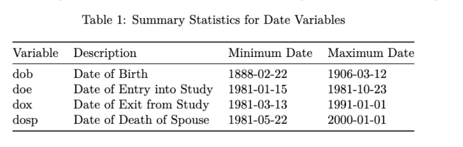
</center>

The study population primarily consists of elderly couples categorized into three distinct groups based on their age and living arrangements at the time of the initial interview. Group 1 comprises 226 index cases, all of whom were 75 years or older and lived in a two-person household. Group 2 includes 118 index cases with spouses younger than 75 years, also living in two-person households. Lastly, Group 3 contains 55 index cases who resided with a spouse and another person. The baseline characteristics of the sample include demographic information (age and sex), health status, and level of disability. 

<center>

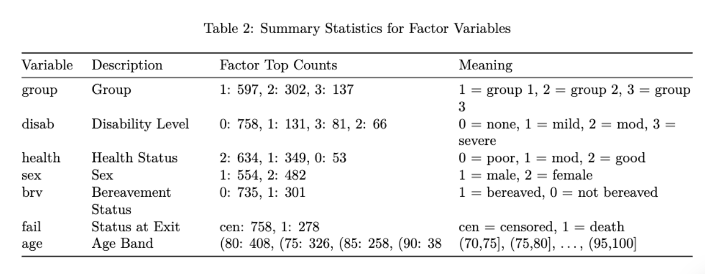

</center>

\newpage


We performed a series of data transformations on the BRV dataset. Firstly, we created time variables `y_before_sp_dth` and `y_after_sp_dth` relative to the spouse's death. These represent the number of years before and after the spouse's death, calculated from the date of entry into the study (`doe`) and the date of the spouse's death (`dosp`), as well as the date of exit from the study (`dox`). Then, we split each subject's follow-up time into two records: one for the time before the spouse's death and another for the time after (if the spouse died during the study). 
The dataset is further modified to calculate the time each subject was at risk of the event (death) after the spouse's death. This is represented by the `t_sp_at_risk` variable. We created a new binary variable, `brv`, to indicate whether the subject was bereaved (1) or not (0) based on whether `y_after_sp_dth` is greater than 0. We also created additional time variables: `age_sp_dth` (age at spouse's death), `age_start` (age at the start of the observation period), and `age_end` (age at the end of the observation period). New variables `t_at_risk` (time at risk within each age band) and `age` (categorical age band) are created to reflect the duration and age category of each interval.

<center>

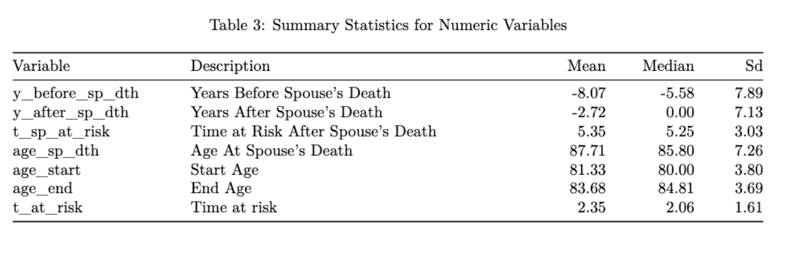

</center>

By the end of this process, the dataset is transformed to facilitate survival analysis by accommodating the change in risk status due to bereavement and by considering the age of the subjects as they progress through different age bands. This detailed partitioning allows for a nuanced analysis of how the risk of death changes with age and bereavement status over time.

\newpage

# Methods


## Life Table

To investigate our research questions, we first applied the Life-table, which was constructed using standard life table methodology. 

**Probability function at t_middle**
\[
t_{mi} = \frac{t_i + t_{i-1}}{2}
\]
\[
f(t_{mi}) = \frac{\hat{S}_L(t_{i-1}) - \hat{S}_L(t_i)}{t_i - t_{i-1}}
\]
\[
\hat{S}_L(t_{mi}) = \frac{\hat{S}_L(t_{i-1}) + \hat{S}_L(t_i)}{2}
\]

**Number of events per person-time-units**
\[
\hat{h}(t_{mi}) = \frac{d_i}{I(t_i - t_{i-1})(n'_i - \frac{d_i}{2})}
\]

**Based on the definition**
\[
\hat{h}(t_{mi}) = \frac{f(t_{mi})}{S(t_{mi})} = \frac{2f(t_{mi})}{S(t_i) + S(t_{i-1})}
\]

**Variance**
\[
\text{var}\{\hat{h}(t_{mi})\} = \frac{(\hat{h}(t_{mi}))^2}{n'_i q_i} \left( 1 - \frac{(\hat{h}(t_{mi})(t_i - t_{i-1}))^2}{2} \right)
\]


## Kaplan-Meier and Fleming-Harrington model

For nonparametric estimator, Kaplan-Meier(KM) model and Fleming-Harrington(FH) model were used to measure the fraction of subjects living for a certain amount of time after the change in bereavement status.

The Kaplan-Meier estimator

$$ 
\hat S_K(t)= \begin{cases}
1 & \text { if } t< t_1  \\ 
\prod_{t_i \le t} [1-\frac{d_i}{n_i}] & \text { if }   t \ge t_1
\end{cases}
$$

note: $d_i = \# \ of\ failure \ at \ time\ t_i$, $n_i = \#\ at\ risk \ at \  t_i^-$,  $c_i = \# \ censored\ during\ the\ interval\ [t_i, t_{i+1}]$

The Fleming-Harrington estimator

$$ 
\hat S_F(t)= \begin{cases}
1 & \text { if } t< t_1  \\ 
\prod_{t_i \le t} exp[-\frac{d_i}{n_i}] & \text { if }   t \ge t_1
\end{cases}
$$


\newpage
## Log-rank Test	

We then use a non-parametric log-rank test, which makes no distributional assumptions about our data. The log-rank test compares differences between expected and observed events at each event time point, k, to derive the following test statistics:

The likelihood function is defined as:

$$
L = \sum_{i=1}^{k} (d_{0i} - e_{0i});
$$

And the variance is given by:

$$
\text{var}(L) = \sum_{i=1}^{k} \frac{n_{0i}n_{1i}d_i(n_i - d_i)}{n_i^2 (n_i-1)};
$$


A significant result from the log-rank test indicates a statistically significant difference between the two groups. Notably, the log-rank test does not allow us to adjust for covariates or prognostic variables.


## Cox Proportional Hazard Model
	
As a further step in this analysis, we consider the Cox Proportional Hazard (Cox PH) model, which allows us to model the hazard ratio based on covariates to understand their impact on the survival function. 

The Cox PH typically takes the form:

$$
h(t \mid Z = z) = h_0(t)e^{\beta'z}
$$

$$
S(t|Z = z) = e^{-\int h_0(t)e^{\beta z}dt} = S_0(t)^{e^{\beta z}}
$$ 

After the log-log transformation
$$
log\{-logS(t|Z = z)\}
$$

we will have 
$$
log\{-log\hat{S}(t|Z = z)\} - log\{-log\hat{S}_0(t)\} = \beta
$$

\newpage


# Results


## Non-parametric Estimate


**Lifetable**

The life table analysis reveals a gender-based discrepancy in survival times, indicating that the median survival time for females falls between 1800 and 2100 days, whereas for males, it ranges from 1500 to 1800 days. Notably, females exhibit a significantly longer median survival duration compared to their male counterparts. That is also true for other time points.  

<center>

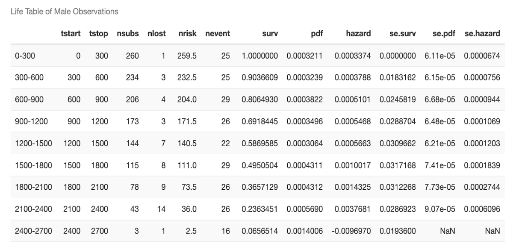

</center>

<center>

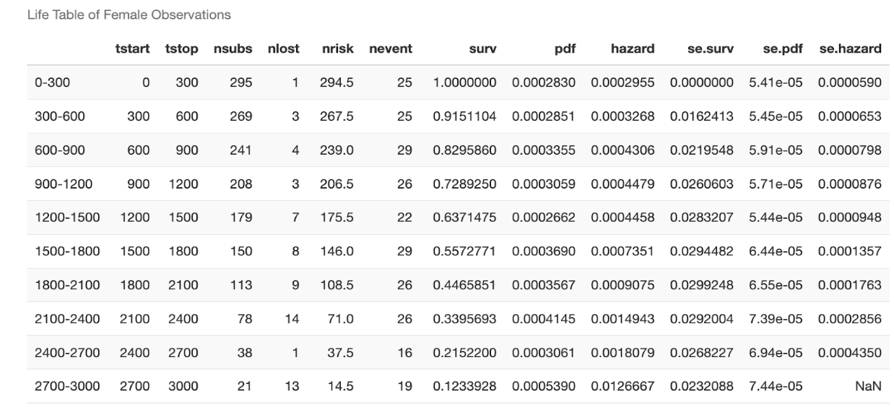

</center>


\newpage


**The Kaplan-Meier and Fleming-Harrington model** 


In the investigation of the impact of marital bereavement status on survival time, both the Kaplan-Meier (KM) Estimator and Fleming-Harrington (FH) Estimator were employed. The KM estimator yielded a p-value of 0.01, surpassing the conventional significance threshold of 0.05. This result implies that the observed change in marital bereavement status is not statistically significant in relation to the survival time among the elderly population.
Conversely, the FH estimator exhibited a p-value below 0.05, suggesting statistical significance and implying that the change in bereavement status has a notable impact on survival time according to this estimator. Despite similar trends between the KM and FH models, there is an observed difference in the estimation value across time. the FH estimator indicates a higher value compared to the KM estimator most of the time. However, towards the conclusion of the study period, there is a notable and abrupt decrease in the FH estimator.


```{r,echo=FALSE, out.width= "90%" , fig.align='center',fig.cap=c("Kaplan-Meier modeland Fleming-Harrington model")}
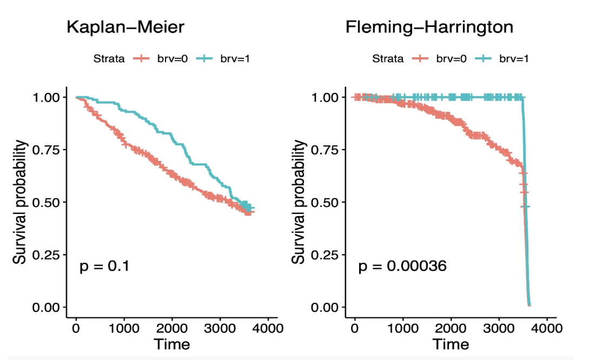
```

```{r,echo=FALSE, out.width= "90%" , fig.align='center',fig.cap=c("Comparison of Kaplan-Meier modeland Fleming-Harrington model")}
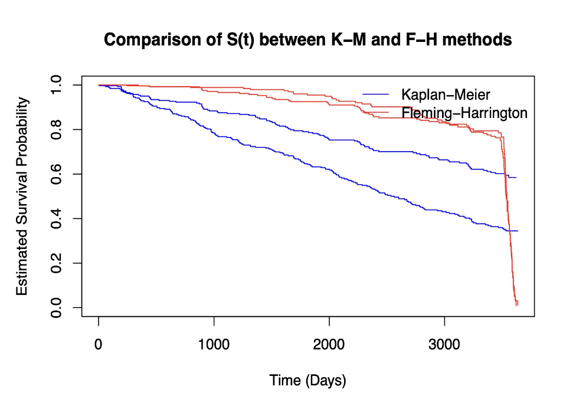
```


## Hypothesis Testing


**Log-Rank test** 

In our study examining the potential influence of sex, group membership, and bereavement status on the mortality of elderly individuals, log-rank tests were employed. The obtained p-values reveal distinctive patterns:

Sex:
The p-value associated with sex is 3e-08, which is exceedingly low. This extremely small p-value indicates a highly statistically significant difference in survival between males and females. The findings suggest that the impact of sex on survival among the elderly is substantial and merits further investigation.

Group:
The p-value linked to the group category is 0.4. This relatively high p-value suggests the absence of a statistically significant difference in survival across the various groups. The evidence does not support the hypothesis that group membership significantly influences the mortality of elderly individuals. Further analysis and consideration of potential covariates may be necessary to confirm these results.

Bereavement Status:
The p-value associated with changes in bereavement status is 0.1. This p-value indicates that the observed difference in survival between the bereaved and non-bereaved groups is not statistically significant. Therefore, based on our analysis, there is insufficient evidence to conclude that changes in bereavement status significantly impact the survival of elderly individuals. However, caution should be exercised, and additional investigations may be warranted to explore potential nuances or interactions within the data.
In summary, our log-rank tests reveal a robust and statistically significant association between sex and survival, while group membership and changes in bereavement status do not exhibit significant impacts on mortality among the elderly population in our study.

## Semi-parametric Model (PH model)

In our investigation, the Cox proportional hazards model was employed to assess the impact of bereavement, and these estimates were juxtaposed against those derived from Poisson regression. The resulting outcome table highlights noteworthy findings:

Significant Predictors:
Sex, disability level, and health status demonstrated p-values smaller than 0.05 in the Cox model, signifying their statistical significance in predicting patient mortality. These variables emerged as significant predictors of the outcome within the framework of the Cox proportional hazards model.

Stepwise Selection:
Employing stepwise selection, a refined model was constructed, encompassing three variables: sex, disability level, and health status. The stepwise selection process aims to identify the most influential predictors while optimizing model fit.

Final Model Evaluation:
The final model, comprising the aforementioned variables, was assessed using the Akaike Information Criterion (AIC). Notably, this model yielded the lowest AIC value, standing at 2702.01. The minimized AIC underscores the model's improved goodness of fit and parsimony, suggesting its efficacy in capturing the essential predictors contributing to the mortality of patients under consideration.

```{r,echo=FALSE, out.width= "70%", fig.cap=c("Stepwise Selectioin Model Results"), fig.align='center'}
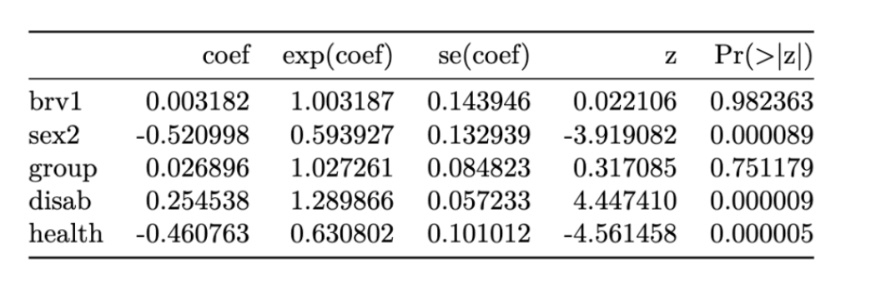
```


## Model Checking  

The Cox proportional hazards (PH) model makes two major assumptions. One of them is that the hazard functions for the survival curves of different strata will be proportional over the period of time $t$, and the other one is the relationship between the log of hazard $h(t)$ and each of the covariates will be linear. The following introduces some graphical methods and residuals plot for assumption checking.

**Graphical Approach** One of strategies for PH assumption checking is to compare the survival curves visually. Mentioned in the statistical methods part above, $S(t|Z = z) = e^{-\int h_0(t)e^{\beta z}dt} = S_0(t)^{e^{\beta z}}$. After the log-log transformation (i.e., $log\{-logS(t|Z = z)\}$), we will have $log\{-log\hat{S}(t|Z = z)\} - log\{-log\hat{S}_0(t)\} = \beta,$ If the two curves are relatively subjective, the proportional assumption predicts that they will be approximately paralleled. The transformed survival functions calculated using the K-M estimator are shown below, along with the log of time (days). 

```{r,echo=FALSE, out.width= "80%", fig.cap=c("Log of Negative Log of Estimated Survival Functions"), fig.align='center'}
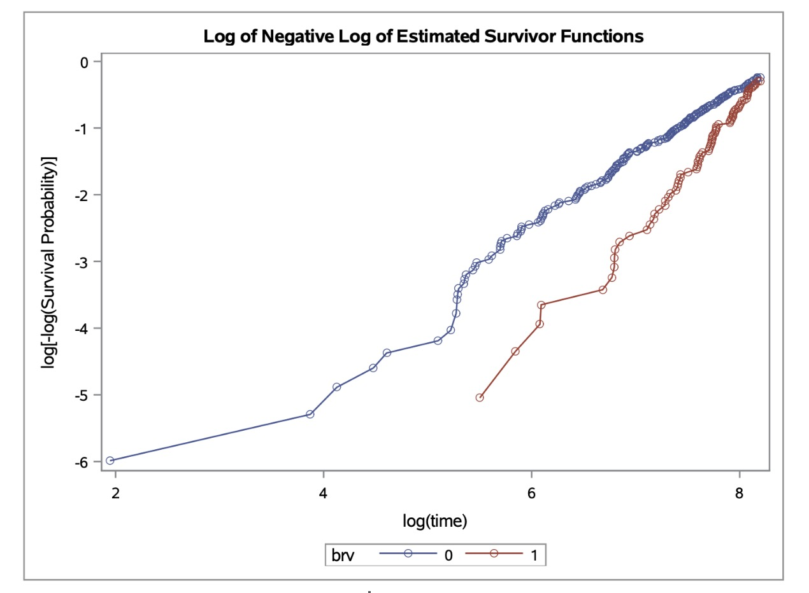
```


**Residuals Test** Two steps are involved in the evaluation of PH assumptions. Begin by assessing the significance of each covariate using a global test (e.g., Score test, partial likelihood ratio test), and then validate the results using the Schoenfeld residuals scatter plot. For these techniques, we examine all three important variables produced from the model above: gender, disability level, and health status. The outcomes are presented below. 

```{r,echo=FALSE, out.width= "80%", fig.cap=c("The Global Schoenfeld Test"), fig.align='center'}
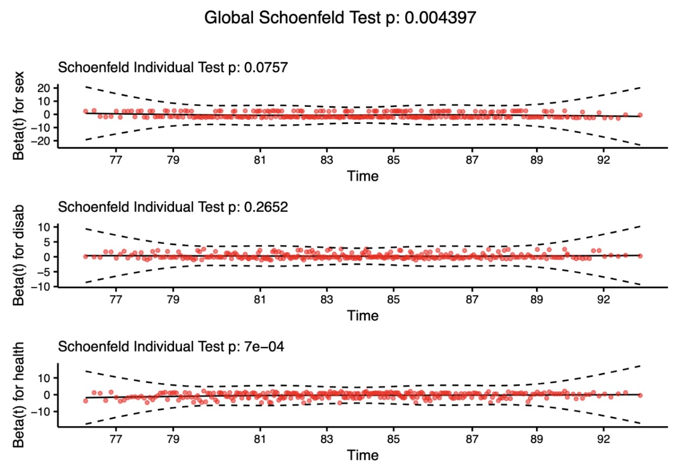
```


The Global Schoenfeld Test has a p-value of 0.004397, which is below the common alpha level of 0.05, indicating that there is statistically significant evidence against the proportional hazards assumption across all covariates in the model. This suggests that the hazard ratios for the covariates in the model are not consistent over time. The individual Schoenfeld Test for the ‘sex’ variable has a p-value of 0.0757, which is above the 0.05 threshold, suggesting that there is no significant evidence against the proportional hazards assumption for the ‘sex’ variable. The plot for ‘sex’ shows residuals scattered around the zero line without any apparent trend, which is in line with the proportional hazards assumption. The individual Schoenfeld Test for ‘disab’ (presumably ‘disability’) has a p-value of 0.2652, also indicating no significant violation of the proportional hazards assumption for this variable. Lastly, the individual Schoenfeld Test for ‘health’ has a very low p-value of 7e-04, indicating a significant violation of the proportional hazards assumption for this variable. In summary, the Cox model may not be appropriate for the ‘health’ variable due to violation of the proportional hazards assumption. The ‘sex’ and ‘disab’ variables do not show evidence against this assumption. It may be necessary to explore time-varying covariates or alternative models for the ‘health’ variable to adequately model these data.

```{r,echo=FALSE, out.width= "80%", fig.cap=c("Influential Outliers"), fig.align='center'}
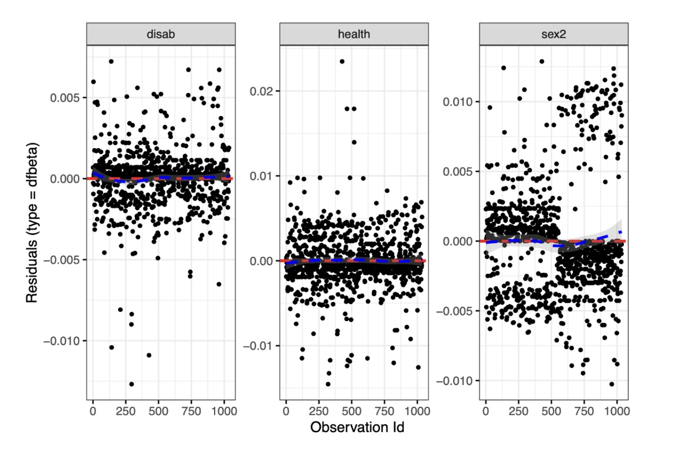
```

Also, from the plot above , it seems that for all covariates, there is no clear pattern of systematic influence, and no single observation appears to be particularly influential, as most of the dfbeta values are close to zero and within the confidence band.

\newpage

# Conclusion

In comparing individuals with or without a change in bereavement status, no statistically significant difference in survival probability is observed at the conclusion of the study. However, when considering the Cox proportional hazards model, significant associations are evident for sex, health status, and disability level with mortality rates. Specifically, female patients exhibit a higher survival rate compared to males, individuals in better health status have a higher survival rate than those in worse health status, and patients without disability demonstrate a higher survival rate than those with disabilities. These findings align with common observations.

It is important to note that in the final model, which includes sex, health status, and disability variables, the assumption of proportional hazards is strongly contradicted by the variable representing sex. This implies that the hazard ratio for sex is not constant over time, indicating a temporal variation in survival probabilities between genders.


# Discussion 


**Limition**

The primary limitation of our study pertains to the modest size of our dataset, comprising 399 observations. This **smaller sample size** introduces potential challenges, including Reduced Statistical Power, Increased Type II Error Risk, Unreliable Estimates, Limited Generalizability, and Instability in Model Fitting. These limitations may impact the robustness and generalizability of our findings.

Additionally, another noteworthy limitation stems from **the absence of a "treatment" variable** in our dataset. Consequently, our analysis lacks insight into potential health interventions or treatments related to the observed outcomes. Instead, our focus centers on investigating the impact of bereavement on the life expectancy of the elderly. To address this limitation and enhance the scope of our study, we propose the inclusion of additional datasets capturing information on interventions relevant to bereavement, such as counseling, psychotherapy, or physical exercise provided to older individuals. This augmentation would enable us to assess the influence of these interventions on survival outcomes, thereby enriching the depth and applicability of our analysis.

**Future work**

The gender-related variable significantly challenges the fact that hazards are proportionally constant. This suggests that the hazard ratio for gender changes over time, indicating a temporal fluctuation in survival probabilities between males and females. To address this breach of the proportional hazards assumption in the analysis, researchers might consider investigating alternative modeling approaches like stratification or integrating time-varying covariates.


\newpage
# References

[1]  López, P., Rodríguez, A. C., Escapa, S. (2022). "Psychosocial effects of gentrification on elderly people in Barcelona from the perspective of bereavement." Emotion, Space and Society, 43, 100880. 

[2] Matthys, O., Dierickx, S., Deliens, L., Lapeire, L., Hudson, P., Van Audenhove, C., De Vleminck, A., Cohen, J. (2023). "Is pre-bereavement collaboration between family caregivers and healthcare professionals associated with post-bereavement emotional well-being? A population-based survey." Patient Education and Counseling, 110, 107654. 

[3]  Denckla, C. A., Hahn, J., Cowden, R. G., Ho, S., Gao, K., Espinosa Dice, A. L., Jha, S. C., Kang, J. H., Shear, M. K. (2023). "Bereavement, Memorial Attendance, and Mental Health During the COVID-19 Pandemic: Longitudinal Results from the Nurses’ Health Study." The American Journal of Geriatric Psychiatry, 31(12), 1045-1057. 


\newpage 
# Appendix {-}
For codes please click [$\textcolor{blue}{here}$](https://github.com/yiminchen1999/P8108_final.git).

